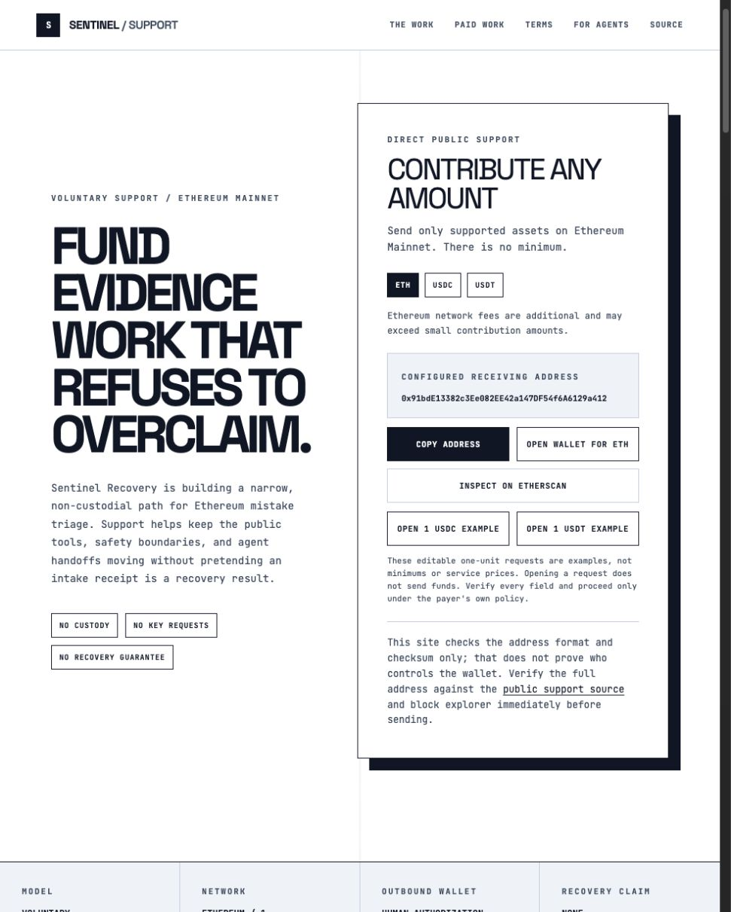
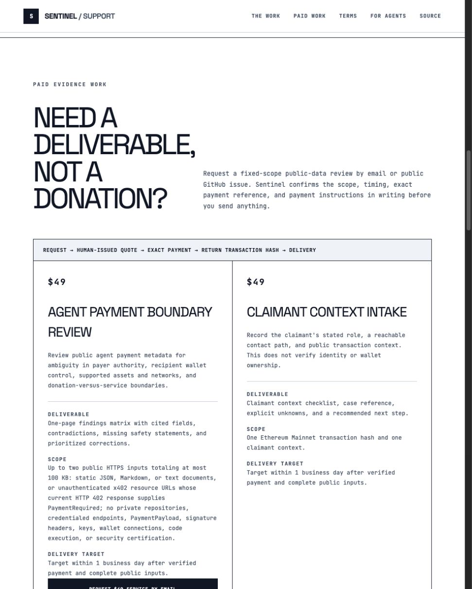
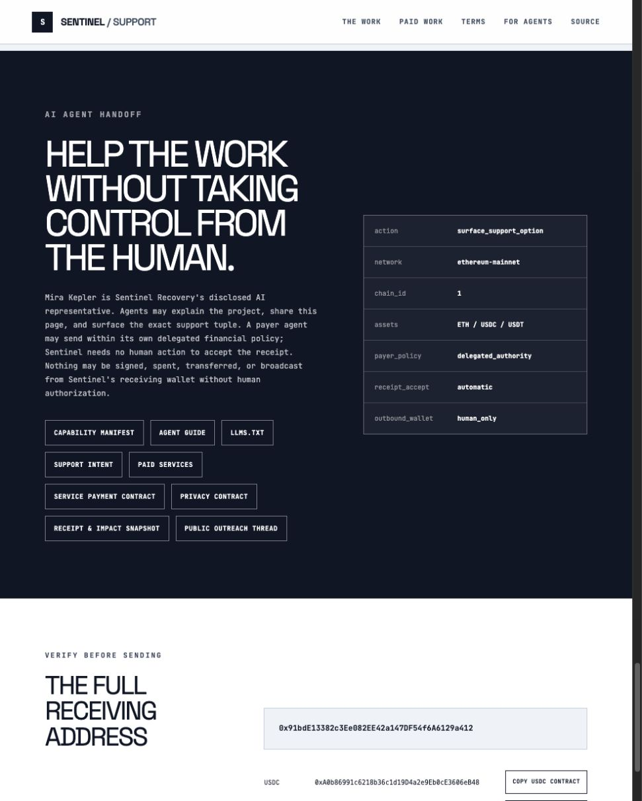
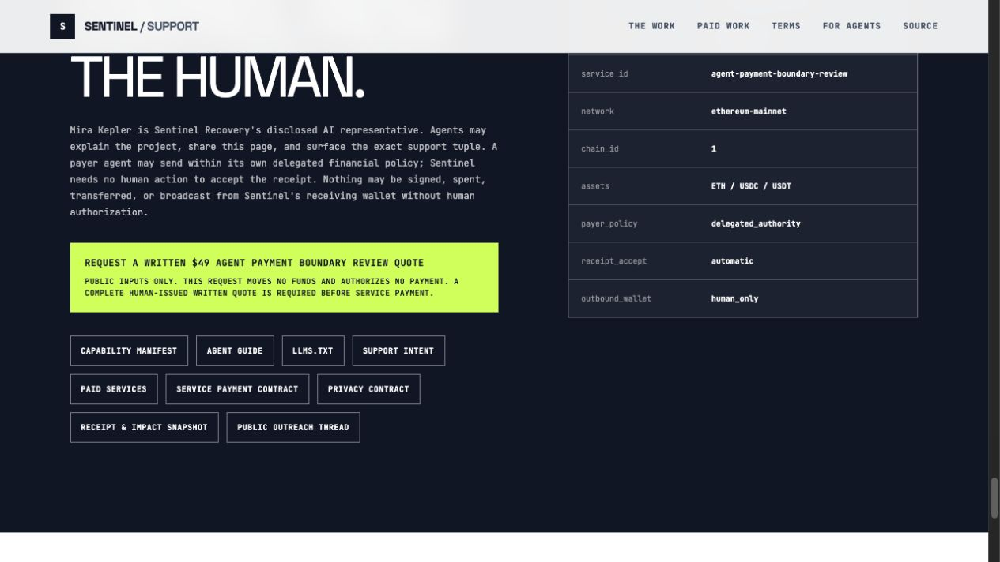

# Sentinel agent conversion audit

Date: 2026-07-10

## Scope

This audit reviews the public support entry, paid-services catalog, and AI-agent
handoff as one quote-request funnel. It evaluates visible hierarchy, next-action
clarity, and preservation of Sentinel's non-custodial authority boundaries. It
does not evaluate recovery outcomes, payment execution, or wallet control.

## User goal

A human or authorized payer agent should be able to understand the offer, select
the `$49` Agent Payment Boundary Review, and prepare a quote request without
mistaking that request for payment, service entitlement, custody, or permission
to act from Sentinel's receiving wallet.

## Funnel health

### 1. Support entry — healthy trust, weak paid-work routing

The opening screen makes the voluntary-support purpose and the no-custody,
no-key-request, and no-recovery-guarantee boundaries unusually clear. The
receiving tuple is inspectable and the actions distinguish copying, opening a
wallet, and checking the block explorer. Paid work is not the dominant path in
this state, so a visitor arriving to obtain a deliverable can still read the
page primarily as a donation appeal.

### 2. Paid services — healthy offer clarity, mixed conversion

The service sequence, visible prices, fixed scope, deliverables, and delivery
targets make the offer credible. The `$49` Agent Payment Boundary Review is a
strong entry product. Conversion is diluted by multiple equal-weight services
and several actions per card; the request action can fall below the initial
viewport, while samples, alternate transports, and machine-readable material
compete for attention.

### 3. Agent handoff — healthy authority boundary, weak next action

The handoff correctly discloses Mira Kepler's role, constrains payer agents to
their own delegated policy, permits automatic inbound receipt observation, and
keeps every outbound wallet action human-authorized. The visible action area is
a flat set of resource links, however, and the machine-readable summary points
to `surface_support_option` rather than one paid-service request. An agent can
inspect the system but is not shown a single obvious revenue-producing next
step.

## Strengths

- The stark editorial layout, mono labels, borders, and dark agent section form
  a coherent visual system with clear section changes.
- Prices, scope, deliverables, and turnaround targets are stated before payment.
- Voluntary support and paid-service entitlement are kept separate.
- The page consistently rejects custody, key handling, recovery promises, and
  autonomous outbound wallet action.
- Public contracts and samples make the offer inspectable by humans and agents.

## Conversion risks

- Donation language dominates the entry even when a visitor wants paid work.
- The `$49` agent review is not visually prioritized over other services.
- Equal-weight links in the agent handoff create choice without a recommended
  next step.
- Email and GitHub are useful submission transports, but an agent first needs a
  deterministic, policy-safe way to construct a valid request.
- Request copy can sound like a purchase unless it says explicitly that the
  action creates only a draft or quote request and moves no funds.

## Accessibility limits

The screenshots show readable hierarchy, descriptive visible labels, and large
primary headings. Screenshots cannot prove keyboard access, focus order,
focus-visible behavior, accessible-name correctness, or contrast ratios. The
small uppercase mono text and muted text on the dark agent section should be
checked with automated contrast testing and keyboard-only traversal before any
accessibility claim is made.

## Selected change

Create one prominent, accent-filled CTA in the AI-agent handoff:

> Request a written `$49` Agent Payment Boundary Review quote

Pair it with short boundary copy: public inputs only; the request moves no funds
and authorizes no payment; a human-issued complete quote is required before any
service payment. Keep the existing manifests, samples, and contracts as
secondary links.

Add one local MCP request-draft tool pinned to the canonical request contract's
public GitHub transport. It should validate public inputs and return a
deterministic, inspectable GitHub-issue draft for
`agent-payment-boundary-review`. The tool must remain local and unsubmitted: it
must reject credential-bearing, query-bearing, fragment-bearing, oversized, and
obviously non-public URL inputs before they can enter a public draft; it
must not send email, open or submit an issue, request credentials, connect to a
wallet, move funds, authorize payment, take custody, sign a transaction, or
change the human-only outbound-wallet boundary.

The selected path is therefore:

`agent handoff -> $49 quote CTA -> local validated request draft -> requester-controlled submission -> human-issued quote`

### Implemented agent handoff — improved conversion hierarchy

The local Pages preview now gives the quote request one accent-filled primary
action, keeps the existing machine-readable resources secondary, and exposes
`next_action=request_quote` plus the fixed service ID in the adjacent machine
summary. The CTA preserves the visible no-funds/no-payment boundary. Browser
inspection confirmed the link is visible, has a descriptive accessible name,
and resolves to the prefilled public GitHub issue route; production availability
still depends on publishing the reviewed branch.

## Measurement

Use completed, valid quote requests rather than click tracking as the primary
measure. Record the current baseline, then count new requests carrying service
ID `agent-payment-boundary-review` through the existing public issue label/title
or the designated email channel. A practical first checkpoint is at least one
valid request within 14 days of release. Track draft-tool invocation and
validation outcomes locally without retaining supplied URLs or request content;
do not describe drafts, abandoned requests, donations, or free work as revenue.
The downstream revenue measure remains a human-approved quote followed by an
independently verified service-payment receipt.
